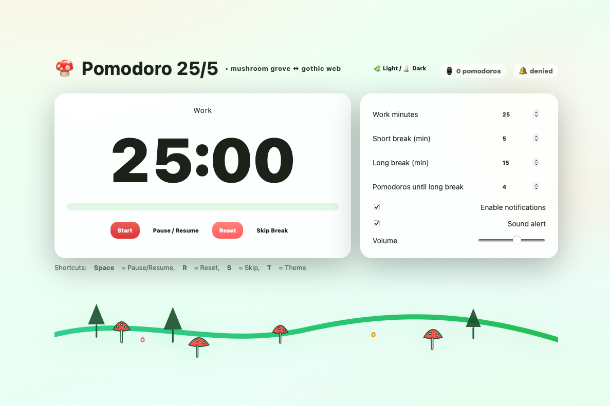
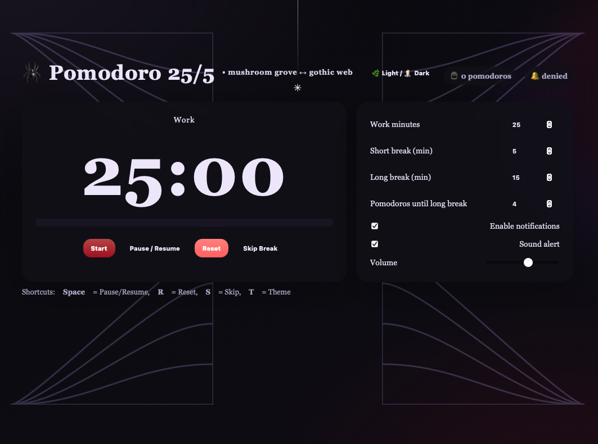

# 🍄 Pomodoro Timer — Mushroom Grove & Gothic Web Themes

A **feature-rich Pomodoro timer** with two immersive themes:

* 🌿 **Mushroom Grove** — a whimsical forest with Amanita mushrooms, flowers, mossy greens, and floating spores.
* 🕷️ **Gothic Web** — a dark, elegant vampire-inspired mode with spiderwebs and subtle animations.

## ✨ Features

* **Customizable intervals**: Work, short break, long break, and cycles until long break.
* **Theme toggle**: Switch between Mushroom Grove & Gothic Web instantly.
* **Keyboard shortcuts**:

  * `Space` — Start / Pause / Resume
  * `R` — Reset
  * `S` — Skip break
  * `T` — Toggle theme
* **Notifications**: Browser notifications for session changes.
* **Sound alerts**: Adjustable volume with charming theme-based sounds.
* **Responsive design**: Works perfectly on desktop and mobile.
* **Single HTML file**: No external dependencies, works offline.

## 📸 Screenshots

### 🌿 Mushroom Grove (Light Mode)

### 🕷 Gothic Web (Dark Mode)

## 🚀 Getting Started

1. **Download** or clone this repository.
2. Open `index.html` in your browser.
3. Allow notifications if prompted.
4. Use the control buttons or keyboard shortcuts to manage your sessions.

## 🛠 Customization

You can tweak:

* **Colors and gradients** for each theme in the `<style>` section.
* **Mushroom, tree, and web decorations** (SVG elements inline).
* Default **timer durations** in the JavaScript variables.

## 📜 License

MIT — Feel free to modify and share.
